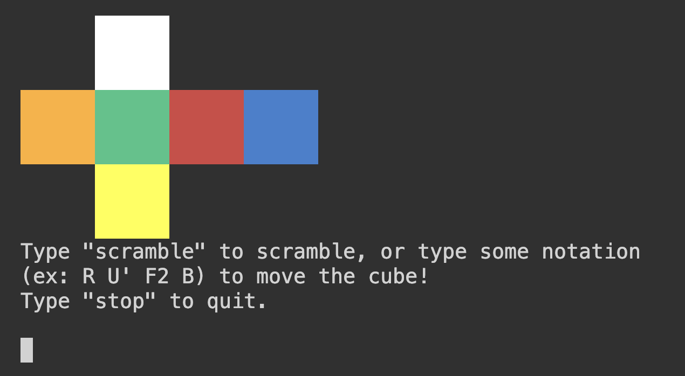

# Rubik's Cube Simulator

This is a simulation built in C++ of a 3x3 Rubik's Cube. The user can utilize the terminal to write commands using Rubik's Cube notation that  decide the cube's move, or can scramble it using an algorithm I built that follows the official World Cube Association scrambling rules. Also, your compiler needs to support C++11 or higher.

# Files
```
RubiksCube.cpp  # Main file that defines all of the functions
RubiksCube.h    # Header file that contains the declarations
driverCube.cpp  # Driver that runs the program
makefile        # makefile for easy running
README.md       # README
DemoPic         # Picture used in the ReadMe
```
# Setup + Run

To setup the program, first download the two .cpp files, thet header, and the makefilfe. Then, compile the files together using these functions. You have two options:

## Option 1: With the makefile (recommended)

```bash
make      # Builds the executable 'rubik'
./rubik   # Runs the program
```
## Option 2: Manual compilation

### MacOS/Linux 
```
g++ driverCube.cpp RubiksCube.cpp -o cube
```
```
./cube
```

### Windows
```
g++ driverCube.cpp RubiksCube.cpp -o cube.exe
```
```
cube.exe
```

You should now see the cube and its colored faces.




